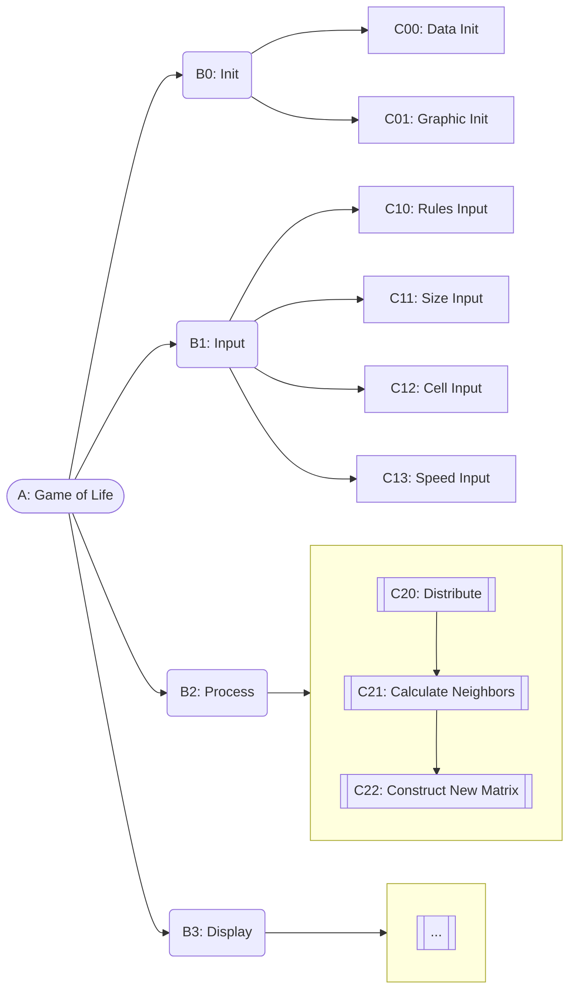

```mermaid
flowchart LR;
	a([A: Game of Life])


	b0(B0: Init)
	b1(B1: Input)
	b2(B2: Process)
	b3(B3: Display)


	c00[C00: Data Init]
	c01[C01: Graphic Init]

	c10[C10: Rules Input]
	c11[C11: Size Input]
	c12[C12: Cell Input]
	c13[C13: Speed Input]

	subgraph c2[ ];
		direction TB

		c20[[C20: Distribute]]
		c21[[C21: Calculate Neighbors]]
		c22[[C22: Construct New Matrix]]

		c20 --> c21 --> c22
	end

	subgraph c3[ ];
		direction TB

		c30[[...]]
	end

	a --> b0 & b1 & b2 & b3

	b0 --> c00 & c01
	b1 --> c10 & c11 & c12 & c13
	b2 --> c2
	b3 --> c3
```
