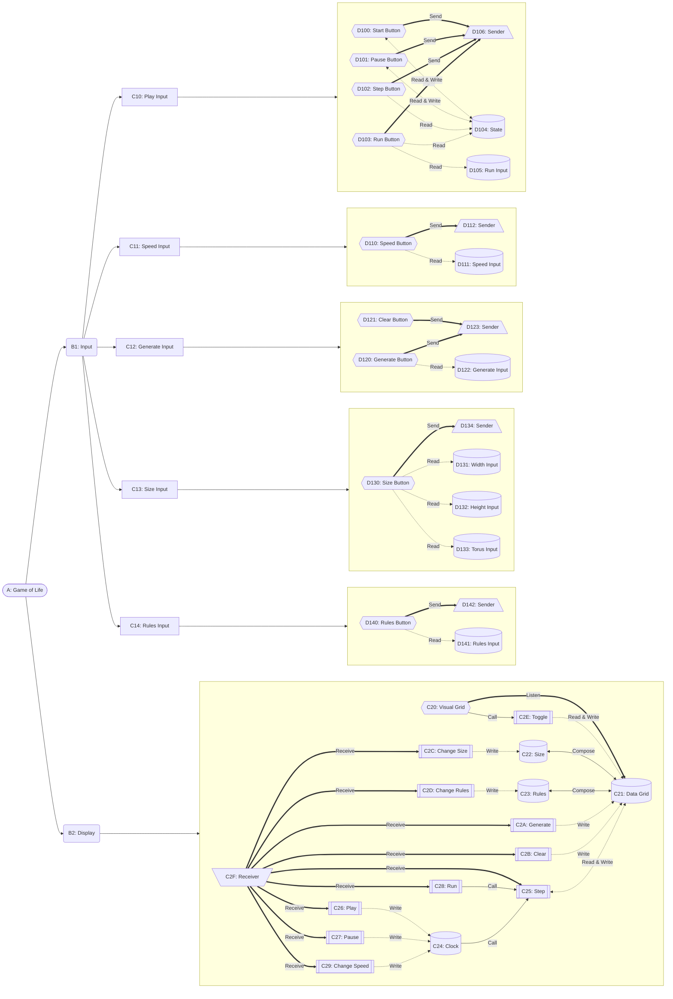

```mermaid
flowchart LR;
	a([A: Game of Life])

	b1(B1: Input)
	b2(B2: Display)

	c10[C10: Play Input]
	c11[C11: Speed Input]
	c12[C12: Generate Input]
	c13[C13: Size Input]
	c14[C14: Rules Input]

	subgraph d10[ ]
		direction LR

		d100{{D100: Start Button}}
		d101{{D101: Pause Button}}
		d102{{D102: Step Button}}
		d103{{D103: Run Button}}

		d104[(D104: State)]
		d105[(D105: Run Input)]

		d106[/D106: Sender\]

		d100 & d101 & d102 & d103 == Send ==> d106
		d100 & d101 <-. Read & Write .-> d104
		d103 -. Read .-> d105
		d102 -. Read .-> d104
		d103 -. Read .-> d104
	end

	subgraph d11[ ]
		direction LR

		d110{{D110: Speed Button}}

		d111[(D111: Speed Input)]

		d112[/D112: Sender\]

		d110 == Send ==> d112
		d110 -. Read .-> d111
	end

	subgraph d12[ ]
		direction LR

		d120{{D120: Generate Button}}
		d121{{D121: Clear Button}}

		d122[(D122: Generate Input)]

		d123[/D123: Sender\]

		d120 & d121 == Send ==> d123
		d120 -. Read .-> d122
	end

	subgraph d13[ ]
		direction LR

		d130{{D130: Size Button}}

		d131[(D131: Width Input)]
		d132[(D132: Height Input)]
		d133[(D133: Torus Input)]

		d134[/D134: Sender\]

		d130 == Send ==> d134
		d130 -. Read .-> d131 & d132 & d133
	end

	subgraph d14[ ]
		direction LR

		d140{{D140: Rules Button}}

		d141[(D141: Rules Input)]

		d142[/D142: Sender\]

		d140 == Send ==> d142
		d140 -. Read .-> d141
	end

	subgraph c2[ ];
		direction LR

		c20{{C20: Visual Grid}}

		c21[(C21: Data Grid)]
		c22[(C22: Size)]
		c23[(C23: Rules)]
		c24[(C24: Clock)]

		c25[[C25: Step]]
		c26[[C26: Play]]
		c27[[C27: Pause]]
		c28[[C28: Run]]
		c29[[C29: Change Speed]]
		c2a[[C2A: Generate]]
		c2b[[C2B: Clear]]
		c2c[[C2C: Change Size]]
		c2d[[C2D: Change Rules]]
		c2e[[C2E: Toggle]]

		c2f[\C2F: Receiver/]

		c20 == Listen ==> c21
		c20 -- Call --> c2e
		c2e -. Read & Write .-> c21
		c2c -. Write .-> c22
		c2d -. Write .-> c23
		c22 & c23 <-- Compose --> c21
		c2f == Receive ==> c25 & c26 & c27 & c28 & c29
		c2f == Receive ==> c2a & c2b & c2c & c2d
		c2a & c2b -. Write .-> c21
		c25 <-. Read & Write .-> c21
		c28 & c24 -- Call --> c25
		c26 & c27 & c29 -. Write .-> c24
	end

	a --> b1 & b2

	b1 --> c10 & c11 & c12 & c13 & c14
	b2 ---> c2

	c10 --> d10
	c11 --> d11
	c12 --> d12
	c13 --> d13
	c14 --> d14
```
