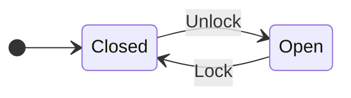
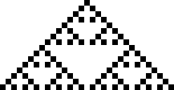
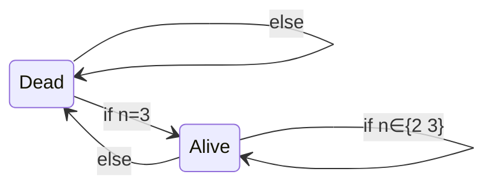
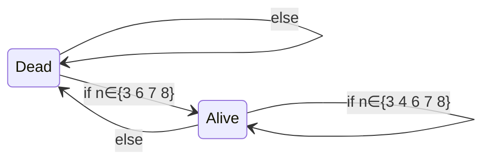
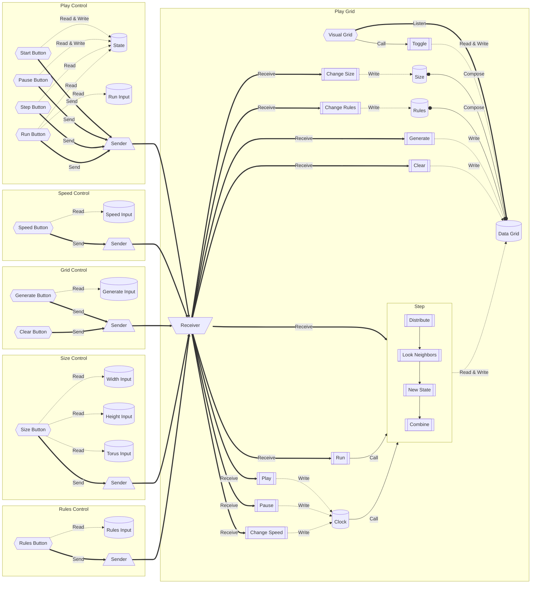

<style>
img {
    image-rendering: -moz-crisp-edges;
    image-rendering: -webkit-crisp-edges;
    image-rendering: pixelated;
    image-rendering: crisp-edges;
}
</style>
<style TYPE="text/css">
code.has-jax {font: inherit; font-size: 100%; background: inherit; border: inherit;}
</style>
<script type="text/x-mathjax-config">
MathJax.Hub.Config({
    tex2jax: {
        inlineMath: [['$','$'], ['\\(','\\)']],
        skipTags: ['script', 'noscript', 'style', 'textarea', 'pre'] // removed 'code' entry
    }
});
MathJax.Hub.Queue(function() {
    var all = MathJax.Hub.getAllJax(), i;
    for(i = 0; i < all.length; i += 1) {
        all[i].SourceElement().parentNode.className += ' has-jax';
    }
});
</script>
<script type="text/javascript" src="https://cdnjs.cloudflare.com/ajax/libs/mathjax/2.7.4/MathJax.js?config=TeX-AMS_HTML-full"></script>

# Sommaire

- [Sommaire](#sommaire)
- [Introduction](#introduction)
	- [Automate fini](#automate-fini)
	- [Automate cellulaire](#automate-cellulaire)
		- [Automate cellulaire élémentaire](#automate-cellulaire-élémentaire)
		- [Généralisation](#généralisation)
	- [Jeu de la vie de Conway](#jeu-de-la-vie-de-conway)
	- [Généralisation du Jeu de la vie](#généralisation-du-jeu-de-la-vie)
- [Cahier des charges](#cahier-des-charges)
	- [Fonctionnalités](#fonctionnalités)
- [Implémentation](#implémentation)
	- [Choix du language](#choix-du-language)
		- [Performance](#performance)
		- [Paradigme & Abstractions](#paradigme--abstractions)
		- [Conformité](#conformité)
	- [Fonctionnement général](#fonctionnement-général)
		- [Framework](#framework)
		- [Application](#application)
	- [Algorithmes](#algorithmes)
		- [Représentation des données](#représentation-des-données)
			- [Cellule](#cellule)
			- [Univers](#univers)
			- [Règles](#règles)
		- [Transition d'état](#transition-détat)
			- [Obtention des voisins](#obtention-des-voisins)
			- [Conversion en nombre](#conversion-en-nombre)
			- [Création du nouvel état](#création-du-nouvel-état)
		- [L'objet `Rules`](#lobjet-rules)
			- [Création des tableaux](#création-des-tableaux)
			- [Entrée utilisateur](#entrée-utilisateur)
- [Conclusion](#conclusion)
	- [Difficultés](#difficultés)
	- [Pour aller plus loin](#pour-aller-plus-loin)
		- [Automates finis](#automates-finis)
		- [Automates cellulaires](#automates-cellulaires)
		- [Jeu de la vie de Conway](#jeu-de-la-vie-de-conway-1)

<div style="page-break-after: always;"></div>

# Introduction

Pour mieux comprendre le jeu de la vie de Conway, il faut revenir à sa définition la plus générale, pour ensuite se spécialiser; remontons donc non pas aux automates cellulaires, mais jusqu'au automates finis.

## Automate fini

Un automate fini, est un système composé d'un nombre fini d'états et de relations entre eux.

Exemple :


Ici cet automate possède 2 états, `Open` et `Closed`  
L'état initial est `Closed`  
L'automate passe de `Open` à `Closed` par la transition `Lock`  
L'automate passe de `Closed` à `Open` par la transition `Unlock`

Un automate fini ne possède que 2 informations pour décider son nouvel état :
- Son état actuel
- Son environnement (ici la transition appliquée)

Il ne possède ainsi pas de mémoire

<div style="page-break-after: always;"></div>

## Automate cellulaire

Un automate cellulaire est une composition de multiple automates finis  
Il est composé d'une grille de ce qu'on appelle "cellule"  
Chaque cellule étant elle-même un automate fini

### Automate cellulaire élémentaire

La catégorie d'automate cellulaire la plus simple est appelée automate cellulaire élémentaire  
Un tel automate consiste d'une ligne uni-dimensionnelle infinie de cellules, soit actives ou inactives :


Chaque cellule calcule son état suivant en prenant en compte son état actuel et ses deux voisins, faisant ainsi $2^3=8$ combinaisons possibles  
Il y a donc $2^8=256$ possibilités de règles

Par exemple, la règle 18 produit le triangle de Sierpiński :



### Généralisation

Les automates cellulaires peuvent aussi exister en 2D, 3D, ou n'importe quel nombre arbitraire de dimensions  
Similairement, ils peuvent aussi exister sur des grilles hexagonales, voire irrégulières  
La manière dont les voisins sont déterminés peut aussi changer  
Il est même possible pour une cellule d'avoir plus de deux états possible

<div style="page-break-after: always;"></div>

## Jeu de la vie de Conway

Le Jeu de la vie de Conway est un automate cellulaire particulier :
- Il se joue sur une grille carré deux-dimensionnelle de taille infinie
- Chaque cellule a 2 états, `Dead` ou `Alive`
- Les voisins d'une cellule sont au nombre de 8, orthogonaux et diagonaux; soit le voisinage de Moore

Le comportement d'une cellule est :  
Avec $n$ le nombre de voisins `Alive` de la cellule



## Généralisation du Jeu de la vie

Le Jeu de la vie étant devenu assez célèbre, il existe de nombreuses variantes  
Ces variantes conservent presque toutes les règles du Jeu de la vie, à l'exception des conditions de transition

Par exemple, la variante Day & Night et définit par le comportement de cellule :  
Avec $n$ le nombre de voisins `Alive` de la cellule



Cette variante est symétrique ; c'est à dire que les cellules `Dead` et `Alive` agissent de manière identique

<div style="page-break-after: always;"></div>

# Cahier des charges

Nous étions chargés de réaliser une implémentation du Jeu de la vie, ainsi que de la variante Day & Night

## Fonctionnalités

Cela devait inclure les fonctionnalités suivantes :

- Dessiner sur la grille
- Changer la taille de la grille
- Changer la vitesse d'exécution des étapes
- Pouvoir changer entre Jeu de la vie et Day & Night
- Executer le jeu pour exactement $n$ étapes

<div style="page-break-after: always;"></div>

# Implémentation

J'ai choisit de réaliser cette application en tant qu'application web, avec l'intégralité des calculs effectués sur la machine de l'utilisateur

## Choix du language

J'ai choisit d'utiliser Rust pour réaliser cette application, et cela pour plusieurs raisons

### Performance

Rust est un langage extrêmement rapide, avec des performances similaires au C  
De plus, malgré le fait que le WebAssembly natif soit moins performant que le JavaScript natif pour un frontend web ; les frameworks web Rust sont plus performants que les frameworks web JavaScript

### Paradigme & Abstractions

Rust est un langage fonctionnel souple ; l'utilisation du paradigme fonctionnel n'est pas forcée au programmeur (contrairement à Haskell ou OCaml), mais elle est très fortement recommandé, notamment car le compilateur sait mieux optimiser les itérateurs que leurs équivalent impératifs

De plus, Rust permet un très grand nombre d'abstractions qui disparaissent complètement à la compilation, elles n’encourent ainsi aucun coût en performance mais permettent un grand gain en lisibilité

### Conformité

Mais le plus grand avantage de Rust est sans aucun doute le fait qu'il force la conformité du code, et empêche directement un très, très grand nombre d'erreurs :

- Libération double de mémoire
- Fuite de mémoire
- Déréférencement d'un pointeur incorrect
- Valeur `NULL` non gérée
- Certains deadlocks
- Data races
- ...

Ainsi la présence de bugs est beaucoup plus rare et l'algorithme programmé respecte sa spécification

<div style="page-break-after: always;"></div>

## Fonctionnement général

J'ai choisi d'utiliser [Yew](https://yew.rs) comme framework

### Framework

C'est un framework basé sur la programmation par composants  
Ainsi, chaque partie de l'application web est découpée puis intégré avec d'autres parties à un composant, formant une unité logique  
L'utilisateur communique avec les composants en leurs envoyant des messages, auxquels les composants vont réagir  
Les composants peuvent aussi s'envoyer des messages entre eux, pour répercuter des changements

### Application

L'application a deux grands types de composants :

- Les émetteurs, qui servent à recevoir des messages de l'utilisateur  
  Ce sont les boutons de configuration
- Un receveur, qui va recevoir les messages des émetteurs et créer le contenu principal de l'application  
  Ici, c'est la grille de jeu

<div style="page-break-after: always;"></div>

Le fonctionnement peut être résumé en un schéma :



Les nodes hexagonales représente les parties recevant de l'entrée utilisateur  
Les trapèzes représentent les émetteur et les receveurs de messages  
Les rectangles représentes les procédures  
Les cylindres représentent les variables 

<div style="page-break-after: always;"></div>

## Algorithmes

Note :  
Rust demande une très grande précision quand il s'agit de se référer au nombres  
Il en est de même pour la différentiation entre une valeur et une référence  
Pour simplifier les algorithmes, tout type numérique sera remplacé par la notation `int`, et les références `&` seront enlevées

De plus, en Rust, la dernière valeur d'une fonction est automatiquement retournée  
Rust considère aussi beaucoup de structure de contrôle comme des valeurs :  
Un `if`/`else` étant garanti de produire une valeur, il est lui-même une valeur

Exemple :

```rust
let y = if x > 5 { 3 } else { 2 };
```

Va assigner 3 à `y` si `x` est supérieur à 5, et 2 dans le cas échéant

### Représentation des données

#### Cellule

Une cellule possède deux états, `Alive` et `Dead`, donc un booléen semble être le meilleur choix ; mais il est possible de faire mieux !  
En effet, en Rust, les énumérations sont des abstractions de coût zéro, et permettent de s'assurer que l'on ne puisse confondre l'état d'une cellule avec autre chose

Nos cellules sont ainsi représentées ainsi :

```rust
enum Cell {
	Alive,
	Dead,
}
```

<div style="page-break-after: always;"></div>

#### Univers

Notre univers contient une grille de cellule  
Il existe deux manières de représenter une tableau et 2 dimensions :

1. Un tableau de tableau
2. Un tableau aplati

La première n'est utile que quand le tableau n'est pas rectangulaire, ainsi la deuxième méthode est préférable  
Ici, pour éviter de réinventer la roue, je vais faire appel à une bibliothèque externe, `grid`, me permettant de traiter mon tableau aplati comme une véritable grille

Mais notre univers doit aussi contenir les règles qui le régisse  
Ainsi que si l'on relie entre eux les bords pour former un tore, ou non

On obtient donc un univers représenté ainsi :
```rust
use grid::Grid;
use rules::Rules;

struct Universe {
	cells:    Grid<Cell>,
	is_torus: bool,

	rules: Rules,
}
```

<div style="page-break-after: always;"></div>

#### Règles

Les règles doivent tout simplement stocker les conditions de transition de l'état `Dead` vers `Alive` et de l'état `Alive` vers `Alive`  
Ainsi le moyen le plus simple serait de stocker les valeurs requises pour ces deux transitions :

```rust
struct Rules {
	birth:   Vec<int>,
	survive: Vec<int>,
}
```

Mais ceci est extrêmement peu performant, car pour déterminer si une cellule doit changer d'état, il y aura besoin d'une recherche dans un tableau, opération de classe $O(n)$, avec $n$ la taille du tableau  
Cela correspond à entre 1 et 8 comparaisons

Il y a moyen de faire bien meilleur, car on peut utiliser l'invariant qu'il n'y aurait jamais plus de 8 voisins pour à la place stocker, pour chaque nombre de voisins, si la cellule doit naître/survivre  
Ensuite, il suffira d'indexer le tableau avec la valeur du nombre de voisins :

```rust
struct Rules {
	birth:   [bool; 8],
	survive: [bool; 8],
}
```

Mais cette méthode nécessite encore le calcul du nombre de voisins, et cela pour chaque cellule  
Il y a encore moyen de faire mieux

En effet, il suffit de stocker si la cellule doit naître/survivre pour chaque possibilité de voisinage  
Il y a $2^8 = 256$ possibilités, un tableau de 256 cases suffira donc :

```rust
struct Rules {
	birth:   [bool; 256]
	survive: [bool; 256]
}
```

<div style="page-break-after: always;"></div>

### Transition d'état

Car chaque transition d'état de l'univers doit être indépendante, il est nécessaire de créer une nouvelle grille

Ensuite, pour chaque cellule, ses voisins sont composé en un nombre, qui sert ensuite à indexer le tableau de naissance/survie

#### Obtention des voisins

Il y a deux cas à gérer pour les voisins :

1. L'univers possède des bords
2. L'univers est un tore

Le premier cas se résout tout seul grâce à la fonction d'indexation sûre de Rust  
En effet, il y a deux moyen d'indexer une séquence en Rust :

1. L'indexation classique, qui panique (crashe) s'il l'on sort des bords :  
   ```rust
   let array: Vec<int> = Vec::new();
   // ...
   let value: int = array[n];
   println!("The value is {value}");
   ```
2. L'indexation sûre, qui retourne soit une valeur, soit rien quand on sort des bords :  
   ```rust
   let array: Vec<int> = Vec::new();
   // ...
   let value: Option<int> = array.get(n);
   match value {
       Some(x) => println!("The value is {x}"),
	   None    => println!("There is no value"),
   };
   ```

Dans le deuxième cas, nous pouvons utiliser l'arithmétique modulaire

<div style="page-break-after: always;"></div>

Nous pouvons donc ajouter deux méthodes très similaires à notre `Universe` :  

```rust
impl Universe {
	fn get_neighbors(self, x: int, y: int) -> [Option<Cell>; 8] {
		// Define neighbors
		const NEIGHBORS: [(int, int); 8] = [
			(-1, -1), (-1, 0), (-1, 1),
			( 0, -1),          ( 0, 1),
			( 1, -1), ( 1, 0), ( 1, 1),
		];

        NEIGHBORS.map(|(i, j)| {
			// Offset
			let x = x + i;
			let y = y + j;

			self.cells.get(x, y)
		})
    }

	fn get_neighbors_torus(self, x: int, y: int) -> [Option<Cell>; 8] {
		// Define neighbors
		const NEIGHBORS: [(int, int); 8] = [
			(-1, -1), (-1, 0), (-1, 1),
			( 0, -1),          ( 0, 1),
			( 1, -1), ( 1, 0), ( 1, 1),
		];

		// Get size
        let (width, height) = self.cells.size();

        NEIGHBORS.map(|(i, j)| {
			// Offset
			let x = x + i;
			let y = y + j;

			// Modular arithmetic
			let x = x.rem_euclid(width);
			let y = y.rem_euclid(height);


			self.cells.get(x, y)
		})
    }
}
```

Nous commençons par définir une constante définissant les 8 décalages de coordonnées    
Ensuite, pour chacun de ces décalage, nous prenons les valeurs décalés  
Si l'on est sur un tore, on applique l'arithmétique modulaire  
Nous pouvons ensuite retourner la valeur du voisin, si il existe

<div style="page-break-after: always;"></div>

#### Conversion en nombre

Maintenant que nous avons les valeurs des voisins, il faut les transformer en nombre pour pouvoir indexer nos tableaux

Pour cela nous allons utiliser une opération de "pliage" de séquence  
Nous pouvons donc ajouter une méthode à notre `Cell`

```rust
use rules::Rules;e

impl Cell {
	use Cell::*;

	fn new_state(self, neighbors: [Option<Cell>; 8], rules: Rules) -> Cell {
		let index = neighbors.iter().fold(0, |collector, new| {
			(collector << 1) | if new == Some(Alive) { 1 } else { 0 }
		});

		if self == Alive {
			rules.survive[index]
		} else {
			rules.birth[index]
		}
	}
}
```

Nous commençons par calculer les 8 voisins avec la fonction précédente  
Ensuite, commençant avec le collecteur à 0, nous définissons une fonction prenant la valeur du collecteur et une nouvelle valeur  
Cette fonction effectue un *left-shift* sur la valeur du collecteur, décalant tout ses bits d'un rang à gauche, cela garantit que le bit le plus à droite vaut 0  
Nous convertissons ensuite la nouvelle valeur, pour le moment une cellule, en nombre, prenant 1 si la cellule est `Alive`, et 0 dans le cas d'une cellule `Dead` ou inexistante  
Ces deux valeurs sont ensuite fusionnées ensemble grâce à un OU au niveau du bit ; cela est possible car le bit le plus à droite du collecteur vaut 0, et que la nouvelle valeur étant soit 1 soit 0, n'affecte que ce bit le plus à droite  
Finalement, suivant la valeur de la cellule en cours de traitement, on indexe soit le tableau de survie, ou de naissance

<div style="page-break-after: always;"></div>

#### Création du nouvel état

Il ne nous reste plus qu'à intégrer la fonction précédente dans une boucle triviale  
En effet, vu que la taille du tableau est variable, aucun invariant ne peut être maintenu pour optimiser le code

Ainsi, nous pouvons ajouter une méthode à notre `Universe` :

```rust
impl Universe {
	// ...

	fn step(mut self) {
		let (width, height) = self.cells.size();

		// Init a new grid of Dead cells
		let mut new_state = Grid::init(width, height, Cell::Dead);

		// For each cell
		for x in 0..width {
			for y in 0..height {
				let cell = self.cells[x][y];

				// Handle torus
				let neighbors = if self.is_torus {
					self.get_neighbors_torus(x, y)
				} else {
					self.get_neighbors(x, y)
				}

				// Determine new state
				new_state[x][y] = cell.new_state(neighbors, self.rules)
			}
		}

		// Update state
		self.cells = new_state;
	}
}
```

Nous commençons par préparer une nouvelle grille  
Ensuite, pour chaque élément de cette grille, nous prenons la valeur d'une cellule originale, avec une indexation classique, car on est sûr de ne pas sortir des bords  
Puis nous calculons les voisins, en prenant en compte s'il on est sur un tore ou non  
Nous calculons le nouvel état de la cellule avec la fonction précédente  
Finalement, nous pouvons changer l'état de notre grille

<div style="page-break-after: always;"></div>

### L'objet `Rules`

#### Création des tableaux

L'opération de création des tableaux des règles n'est que rarement appelée, donc il n'y a pas besoin de chercher à l'optimiser au maximum

Ainsi l'algorithme est assez naïf :

```rust
use core::array;

impl Rules {
	fn new(birth_vec: Vec<int>, survive_vec: Vec<int>) -> Rules {
		use Cell::*;

		let birth: [Cell; 256] = array::from_fn(|i| {
			let neighbors = i.count_ones();

			if birth_vec.contains(neighbors) { Alive } else { Dead }
		});

		let survive: [Cell; 256] = array::from_fn(|i| {
			let n_neighbors = i.count_ones();

			if survive_vec.contains(neighbors) { Alive } else { Dead }
		});
	}
}
```

Nous commençons par prendre chaque valeur de 0 à 255  
Ensuite, pour chaque valeur, on prend le nombre de 1 dans sa représentation binaire, ce qui correspond au nombre de voisins  
Nous déterminons ensuite si ce nombre de voisins correspond à une survie/naissance et assignons la valeur correspondante

Malgré la présence d'une double itération, cela est nécessaire pour que Rust puisse identifier la création d'un tableau de taille fixe  
Mais après passage du compilateur, ceci sera corrigé

<div style="page-break-after: always;"></div>

#### Entrée utilisateur

L'utilisateur va être capable de choisir les règles à utiliser  
Pour faire cela, il utilisera une notation `B{x}/S{y}`  
Où `{x}` sera les nombres de voisins ou pour lesquels une cellule naît  
Et `{y}` sera les nombres de voisins ou pour lesquels une cellule survie

Cela peut être élégamment pris en charge par un Regex  
Nous pouvons donc ajouter une méthode à nos `Rules` :  
(Notes: quelques détails d'implémentation ont été enlevés pour rendre le code plus clair)

```rust
use regex::{regex, Regex};

impl Rules {
	// ...

	fn from_string(user_input: String) -> Result<Rules, ()> {
		const RULES_REGEX: Regex = regex!(r"^B([0-8]+)/S([0-8]+)$");

		if let Some(captures) = RULES_REGEX.captures(user_input) {
			let birth = captures[0].chars()
								   .map(|c| c.to_digit(10))
								   .collect::<Vec<_>>()

			let survive = captures[1].chars()
								     .map(|c| c.to_digit(10))
								     .collect::<Vec<_>>()

			Rules::new(birth, survive)
		} else {
			Err(())
		}
	}
}
```

Premièrement, le Regex va capturer `{x}` et `{y}`, s'il ne peut pas, car l'entrée est incorrecte, alors on retourne une erreur  
Ensuite, nous transformons les deux chaînes de caractères en suite de chiffres  
Finalement, nous pouvons créer les nouvelles règles avec la fonction précédente

<div style="page-break-after: always;"></div>

# Conclusion

## Difficultés

La plupart des difficultés que j'ai rencontrée était avec l'utilisation d'un framework orienté composant, paradigme avec lequel je ne suis pas très familier  
Une autre grande classe de difficultés était avec l'écriture du CSS (plus exactement Sass, un superset du CSS)  
Finalement les quelques erreurs restantes était avec quelques cas spécifiques du système de propriété de Rust

## Pour aller plus loin

### Automates finis

Les automates finis sont très souvent utilisés comme moyen de modélisation d'un système  
Ils représentent un langage compris à la fois par un ingénieur et un programmeur, facilitant la réalisation de projets liant les deux

Mais ils sont aussi utilisés lors de la compilation de langages vers du code machine, pour gérer le code asynchrone  
Certains langages (dont Rust), n'ont pas de *runtime*, rendant la gestion de code asynchrone, d'attente en parallèle de plusieurs ressources, compliquée ; pour cela, leurs compilateurs font faire usages d'automates finis pour représenter de tels systèmes

Certaines pratiques de programmation sont basées sur les automates finis  
Par exemple, le pattern *Typestate*, une extension du pattern *Builder* utilise un système d'état pour représenter l’initialisation d'un objet complexe  
Il est notamment utilisé par la bibliothèque [`http`](https://crates.io/crates/http) de Rust, séparant l'état d'un requête HTTP avec et sans headers, ... ; avec pour but d’empêcher l'initialisation d'une requête mal formée 

### Automates cellulaires

Les automates cellulaires sont utilisés en physique pour simuler certains modèles  
Avec dans certains domaines l'ajout de transitions d'état probabilistes  
Ce sont souvent des automates cellulaires en deux ou trois dimensions qui sont utilisés

Ils sont aussi utilisés pour résoudre certains problèmes informatique de synchronisation  
Notamment le problème du peloton d’exécution, résolu avec un automate cellulaire avec 6 états et une dimension  
Ce problème vise à synchroniser une ligne d'entités n'ayant pas de mémoire et ne communiquant qu'avec leurs voisins ; l'utilisation d'un automate cellulaire y est alors logique est optimale

Des automates cellulaires sont aussi utilisés pour la génération de terrain procédurale dans certains jeux  
Mais cela reste rare, car dans ce domaine, les fonctions de bruits règnent suprême, et plus récemment, les algorithmes d’effondrement d'onde quantiques

<div style="page-break-after: always;"></div>

### Jeu de la vie de Conway

Le jeu de la vie de Conway n'a pas d'application réelle, mais sert d'illustration à beaucoup de concepts de l'étude des automates

Il a aussi inspiré beaucoup de gens à créer  
Ainsi, il existe un grands nombre de figures intéressantes qui ont étés découvertes, tels des oscillateurs, vaisseaux, cannons, ...  
L'exemple le plus marquant est la création du jeu de la vie ... dans le jeu de la vie lui-même  
Cela est rendu possible car le jeu de la vie est *Turing-complete* et capable de réaliser n'importe quel calcul, si donné un temps infini
