# Démineur

**Tom OLIVIER**  
2022  
IUT Amiens  

## Introduction

Le jeu Démineur est un jeu de réflexion qui consiste à découvrir et marquer l'emplacement des mines cachées dans une grille de cases. Le joueur doit utiliser sa logique et ses déductions pour éviter de déclencher les mines et parvenir à découvrir toutes les cases saines de la grille. Le jeu est souvent présenté sous la forme d'un tableau carré divisé en cases, chacune pouvant être vide ou cacher une mine. Le joueur doit cliquer sur les cases une par une, et est informé du nombre de mines qui se trouvent dans les cases adjacentes lorsqu'il clique sur une case vide. En utilisant ces indices, le joueur doit déduire l'emplacement des mines et les marquer en cliquant sur les cases correspondantes avec le bouton droit de la souris. Le jeu se termine lorsque le joueur a révélé toutes les cases saines ou lorsqu'il a déclenché une mine. Le Démineur est un jeu très populaire depuis de nombreuses années et est disponible sur de nombreuses plateformes, y compris les ordinateurs de bureau, les ordinateurs portables, les téléphones mobiles et les consoles de jeux.
## Partie 1 : Analyse description de niveau zéro

Le champ de mines du Démineur est représenté par une grille, qui peut avoir différentes formes : deux ou trois dimensions, pavage rectangulaire ou non, etc.

Chaque case de la grille peut soit cacher une mine, soit être vide. Le but du jeu est de découvrir toutes les cases libres sans faire exploser les mines, c'est-à-dire sans cliquer sur les cases qui les dissimulent.

Lorsque le joueur clique sur une case libre comportant au moins une mine dans l'une de ses cases avoisinantes, un chiffre apparaît, indiquant ce nombre de mines. Si en revanche toutes les cases adjacentes sont vides, une case vide est affichée et la même opération est répétée sur ces cases, et ce jusqu'à ce que la zone vide soit entièrement délimitée par des chiffres. En comparant les différentes informations récoltées, le joueur peut ainsi progresser dans le déminage du terrain. S'il se trompe et clique sur une mine, il a perdu.


## Cahier des charges

1. Le jeu posséde 3 niveaux de difficulté (débutant, intermédaire, avancé)
2. Les mines sont initialisées aléatoirement.
3. Le premier clique du joueur ne peut pas être une mine.
4. Le joueur peut ajouter des drapeaux sur les cases qu'il pense contenir une mine.
5. Afficher le nombre de mines restantes.
6. Ajouter une IA pour résoudre et gagner le jeu.


## Partie 2 : AHF

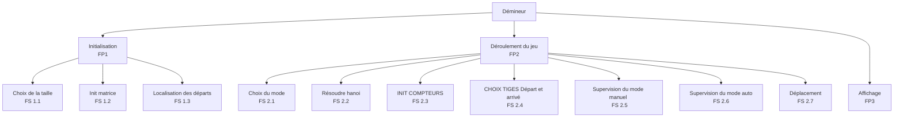

## Partie 3 : Analyse

---
| Choix de la taille | FS 1.1
|---|-

---
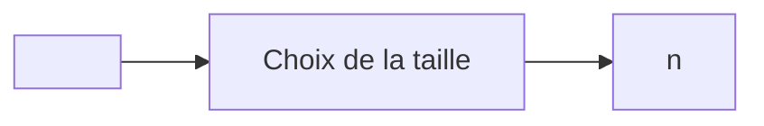
---
**Algorithme** :
```scilab
n = input('Nombre de disques')
```
---
  
<br>

---
| Init matrice | FS 1.2
|---|---|

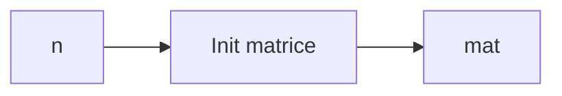

---
**Algorithme** :
```scilab
mat = zeros(n,3)

for i = 1:n
    for j = 1:3
        if j == 1
            mat(i,j)=i;
        else
            mat(i,j)=0;
        end
    end 
end
```
---
  
<br>

---
| Localisation des départs | FS 1.3
|---|-

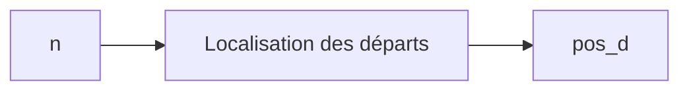
---
**Algorithme** :
```scilab
pos_d=[0,n,n]

disp(mat)
disp(pos_d)
```
---
  
<br>

---
| Choix du mode | FS 2.1
|---|-

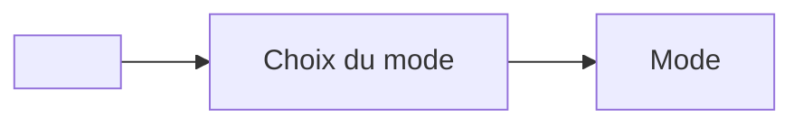
---
**Algorithme** :
```scilab
Mode=input('départ avec le  mode 0  AUTO 1  MAN   ');
```
---
  
<br>

---
| Résoudre hanoi | FS 2.2
|---|-

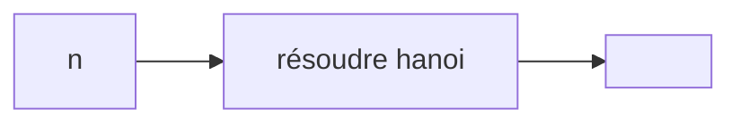
---
**Algorithme** :
```scilab
global td_opt ta_opt cpt
cpt=1

hanoi(n,1,2,3);

function hanoi(n,D,I,F)
global td_opt ta_opt cpt
    if n>0 then
         hanoi(n-1,D,F,I)
         //printf('Déplacer le disque %1.0f de la tige %1.0f vers  %1.0f  \n', n, D ,F)
           td_opt(cpt)=D
           ta_opt(cpt)=F
           cpt=cpt+1
         hanoi(n-1,I,D,F)
    end
end
```
---
  
<br>

---
| INIT COMPTEURS | FS 2.3
|---|-

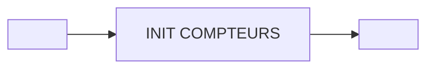
---
**Algorithme** :
```scilab
cmpt2=1
cmpt3=1
ctrl=1
win=0
ctrl=1

while ~win
    cdn=0
    switch Mode

case 1
    // FS 2.4
    // FS 2.5
    // FS 2.6

case 0
    // 2.6
    // 2.7
    // FP3
end

if  win
    disp('You win')
else
    disp('Game over')
end
```
---
  
<br>

---
| CHOIX TIGES Départ et arrivé  | FS 2.4
|---|-

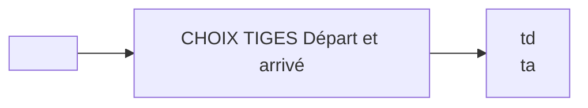
---
**Algorithme** :
```scilab
td=input ( ' tige de départ   ')
ta=input ( ' tige d''arrivé   ')
```
---
  
<br>

---
| Supervision du mode manuel | FS 2.5
|---|-

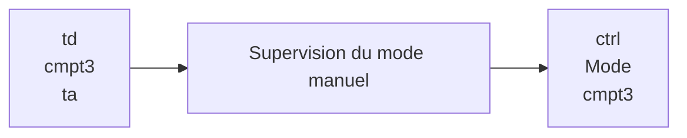
---
**Algorithme** :
```scilab
if (td==td_opt(cmpt3)) && (ta==ta_opt(cmpt3))
    cmpt3=cmpt3+1
else
    ctrl=0
end

Mode=input('continuer avec le mode 0 AUTO 1 MAN  2 quit X');
```
---
  
<br>

---
| Localisation des disques | FS 2.6
|---|-

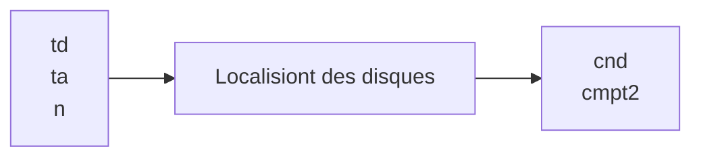
---
**Algorithme** :
```scilab
if (td>0)&&(td<4)&&(ta>0)&&(ta<4)&&(ta~=td)

    xd=pos_d(td)+1
    xa=pos_d(ta)
    yd=td
    ya=ta
    cdn=1


    if xd<n
        nd=mat(xd,yd)
        if xa ==n
            cdn=1
        elseif nd<mat(xa+1,ya)
            cdn=1
        else
            cdn=0
            cmpt2=cmpt2-1
        end
    end
end
```
---
  
<br>

---
| Localisation des disques | FS 2.6
|---|-

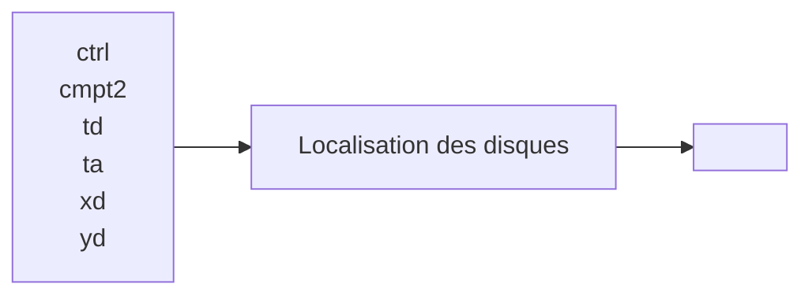
---
**Algorithme** :
```scilab
    if ctrl==1
        cdn=1
        td=td_opt(cmpt2)
        ta=ta_opt(cmpt2)
        xd=pos_d(td)+1
        xa=pos_d(ta)
        yd=td
        ya=ta
        nd=mat(xd,yd)
    else
        Mode=1
        disp('vous pouvez pas continuer en ce mode')
    end
else
    break 
```
---
  
<br>

---
| Déplacement de disque | FS 2.7
|---|-

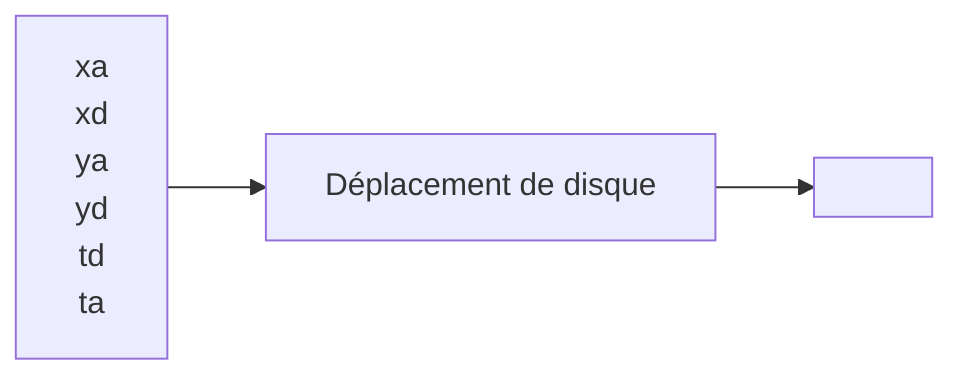
---
**Algorithme** :
```scilab
if cdn
    mat(xa,ya)=mat(xd,yd)
    mat(xd,yd)=0
    pos_d(td)=pos_d(td)+1
    pos_d(ta)=pos_d(ta)-1
end
```
---
  
<br>

---
| Affichage | FP 3
|---|-

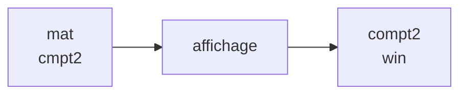
---
**Algorithme** :
```scilab
disp(mat)
disp(cmpt2)
cmpt2=cmpt2+1
win=(mat(1,3)==1)
```
---

## Conclusion

La Tour de Hanoï est un jeu de logique passionnant qui met à l'épreuve les capacités de résolution de problèmes des joueurs. Nos résultats suggèrent que la complexité du jeu et l'expérience du joueur peuvent être des facteurs importants dans la résolution du jeu. 

La tâche de la Tour de Hanoï est utilisée dans la recherche en psychologie notamment au travers de la résolution de problème. Il est également utilisé comme test neuropsychologique.

Cette tâche est sensible aux dysfonctionnements frontaux et préfrontaux.

Ce test permet ainsi l'évaluation des fonctions exécutives, comme la planification, la mémoire de travail et l'inhibition.