# Tour d’Hanoï

**Tom OLIVIER**  
2022  
IUT Amiens  

## Introduction

La Tour de Hanoï est un jeu de logique pour un seul joueur. Le but du jeu est de déplacer un ensemble de disques de différentes tailles d'un poteau à un autre, en respectant certaines règles. Les règles sont les suivantes :

 - Vous ne pouvez déplacer qu'un seul disque à la fois.
 - Vous ne pouvez déplacer un disque que sur un autre disque plus grand ou sur un poteau vide.
 - Vous ne pouvez pas placer un disque plus grand sur un disque plus petit.

La Tour de Hanoï est un jeu fascinant pour les amateurs de logique et de stratégie. Bien qu'il puisse sembler simple au premier abord, la Tour de Hanoï peut devenir très complexe et difficile à résoudre. De nombreuses variantes du jeu ont été créées au fil des années, ajoutant encore plus de complexité et de défi. Malgré cela, la Tour de Hanoï reste un jeu passionnant pour les joueurs de tous niveaux.

## Partie 1 : Analyse description de niveau zéro

Le plateau est composé de 3 tige.


## Cahier des charges

Des actions possibles avant l'exécution du programme :
 - Choisir le nombre de disques.
 - Choisir le mode de jeu (manuel ou automatique).
 - Possibilité de quitter le jeu.

Des actions possibles pendant l'exécution du programme :
 - Pouvoir superviser le mode manuel
 - Afficher un compteur de mouvements
 - Changer le mode manuel en automatique
 - Possibilité de quitter le jeu.


## Partie 2 : AHF

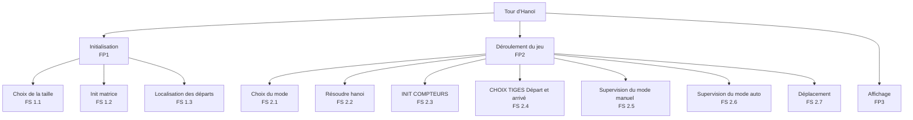

## Partie 3 : Analyse

---
| Choix de la taille | FS 1.1
|---|-

---
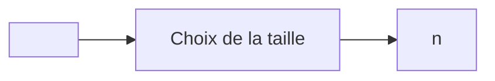
---
**Algorithme** :
```scilab
n = input('Nombre de disques')
```
---
  
<br>

---
| Init matrice | FS 1.2
|---|---|

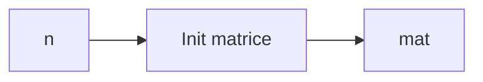

---
**Algorithme** :
```scilab
mat = zeros(n,3)

for i = 1:n
    for j = 1:3
        if j == 1
            mat(i,j)=i;
        else
            mat(i,j)=0;
        end
    end 
end
```
---
  
<br>

---
| Localisation des départs | FS 1.3
|---|-

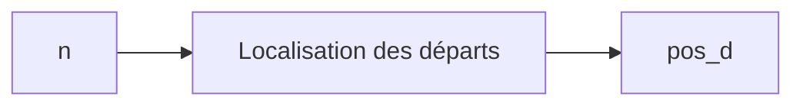
---
**Algorithme** :
```scilab
pos_d=[0,n,n]

disp(mat)
disp(pos_d)
```
---
  
<br>

---
| Choix du mode | FS 2.1
|---|-

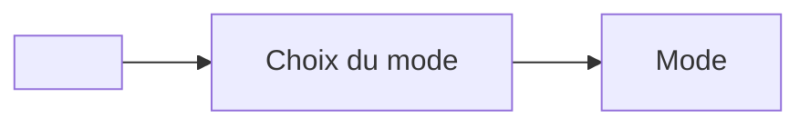
---
**Algorithme** :
```scilab
Mode=input('départ avec le  mode 0  AUTO 1  MAN   ');
```
---
  
<br>

---
| Résoudre hanoi | FS 2.2
|---|-

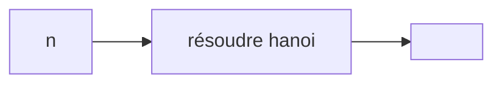
---
**Algorithme** :
```scilab
global td_opt ta_opt cpt
cpt=1

hanoi(n,1,2,3);

function hanoi(n,D,I,F)
global td_opt ta_opt cpt
    if n>0 then
         hanoi(n-1,D,F,I)
         //printf('Déplacer le disque %1.0f de la tige %1.0f vers  %1.0f  \n', n, D ,F)
           td_opt(cpt)=D
           ta_opt(cpt)=F
           cpt=cpt+1
         hanoi(n-1,I,D,F)
    end
end
```
---
  
<br>

---
| INIT COMPTEURS | FS 2.3
|---|-


---
**Algorithme** :
```scilab
cmpt2=1
cmpt3=1
ctrl=1
win=0
ctrl=1

while ~win
    cdn=0
    switch Mode

case 1
    // FS 2.4
    // FS 2.5
    // FS 2.6

case 0
    // 2.6
    // 2.7
    // FP3
end

if  win
    disp('You win')
else
    disp('Game over')
end
```
---
  
<br>

---
| CHOIX TIGES Départ et arrivé  | FS 2.4
|---|-

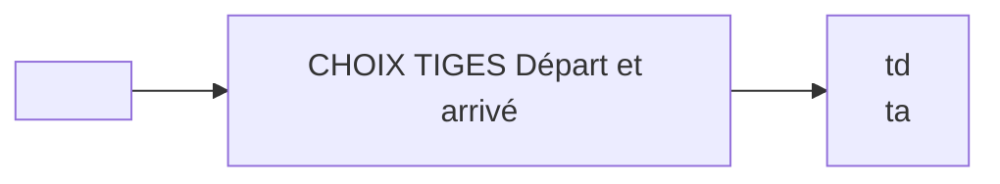
---
**Algorithme** :
```scilab
td=input ( ' tige de départ   ')
ta=input ( ' tige d''arrivé   ')
```
---
  
<br>

---
| Supervision du mode manuel | FS 2.5
|---|-

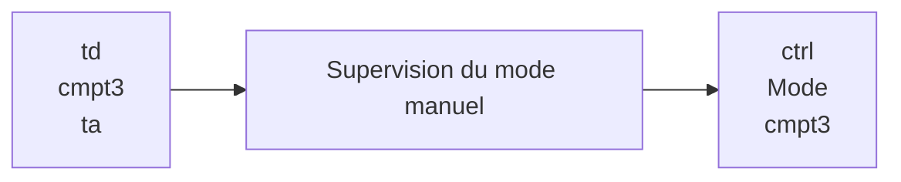
---
**Algorithme** :
```scilab
if (td==td_opt(cmpt3)) && (ta==ta_opt(cmpt3))
    cmpt3=cmpt3+1
else
    ctrl=0
end

Mode=input('continuer avec le mode 0 AUTO 1 MAN  2 quit X');
```
---
  
<br>

---
| Localisation des disques | FS 2.6
|---|-

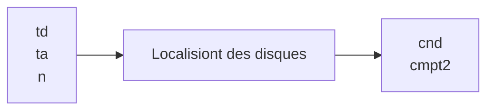
---
**Algorithme** :
```scilab
if (td>0)&&(td<4)&&(ta>0)&&(ta<4)&&(ta~=td)

    xd=pos_d(td)+1
    xa=pos_d(ta)
    yd=td
    ya=ta
    cdn=1


    if xd<n
        nd=mat(xd,yd)
        if xa ==n
            cdn=1
        elseif nd<mat(xa+1,ya)
            cdn=1
        else
            cdn=0
            cmpt2=cmpt2-1
        end
    end
end
```
---
  
<br>

---
| Localisation des disques | FS 2.6
|---|-

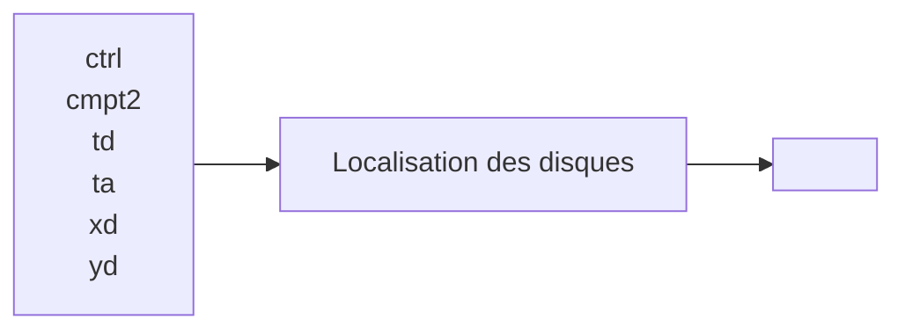
---
**Algorithme** :
```scilab
    if ctrl==1
        cdn=1
        td=td_opt(cmpt2)
        ta=ta_opt(cmpt2)
        xd=pos_d(td)+1
        xa=pos_d(ta)
        yd=td
        ya=ta
        nd=mat(xd,yd)
    else
        Mode=1
        disp('vous pouvez pas continuer en ce mode')
    end
else
    break 
```
---
  
<br>

---
| Déplacement de disque | FS 2.7
|---|-

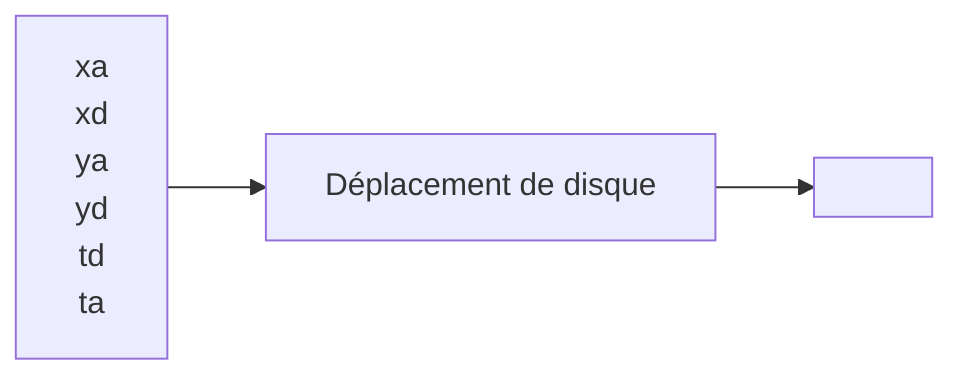
---
**Algorithme** :
```scilab
if cdn
    mat(xa,ya)=mat(xd,yd)
    mat(xd,yd)=0
    pos_d(td)=pos_d(td)+1
    pos_d(ta)=pos_d(ta)-1
end
```
---
  
<br>

---
| Affichage | FP 3
|---|-

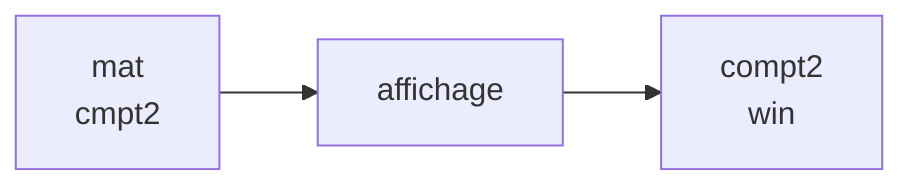
---
**Algorithme** :
```scilab
disp(mat)
disp(cmpt2)
cmpt2=cmpt2+1
win=(mat(1,3)==1)
```
---

## Conlusion
